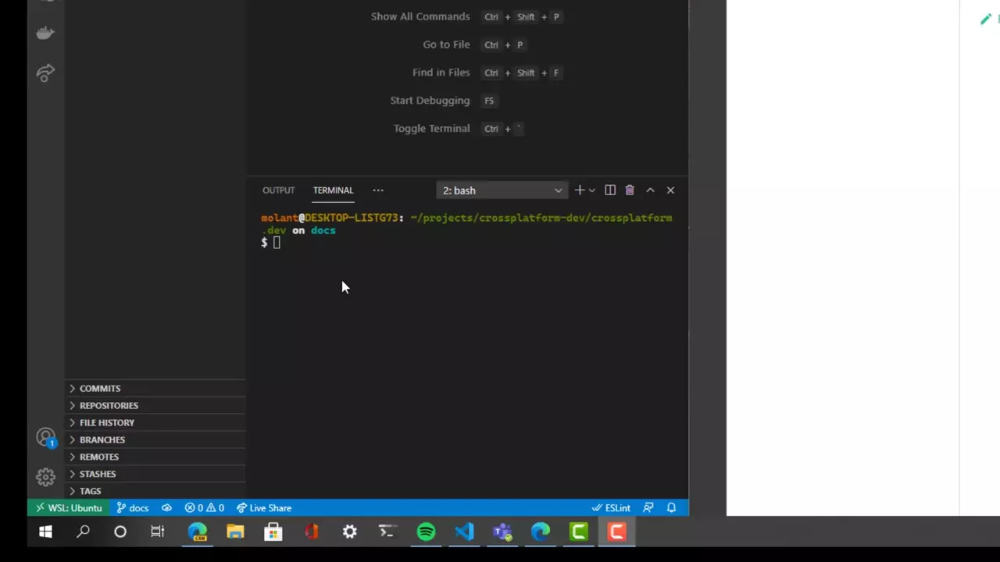

# Crossplatform.dev

This repository contains the code and contents of https://crossplatform.dev.

It is built using [Docusaurus 2](https://docusaurus.io/) and deployed on Netlify.

## Installation

To install it locally, you will need to:

* Install [Git] and [Node.js] installed on your machine
* Clone and install the dependencies of the project:

  ```console
  git clone https://github.com/crossplatform-dev/crossplatform.dev
  cd crossplatform.dev
  npm install
  ```

## Local Development

The project has the following folder structure:

```
crossplatform.dev
 |
 ├─ blog → Markdown files with the blogposts
 |
 ├─ docs → Markdown files with the contents of the documentation
 |
 ├─ scripts → JavaScript with the technology scaffolders and such
 |
 ├─ src → Docusaurus code
 |
 ├─ static → Docusaurus static assets
```

The following command will start a local development server and
open up a browser window:

```console
npm start
```

Most changes, like markdown modifications, `sidebars.js`, etc. are
reflected live without having to restart the server.

To create a new technology overview, run the following command:

```console
npm run add-technology
```

You will be prompted the technology name and once provided:

* a new folder will be created under `/docs/` with its name
* the folder will have a few markdown files for you to complete
* `sidebars.js` will be updated to include the new technology




[git]: https://git-scm.com/downloads
[node.js]: https://nodejs.org/en/download/